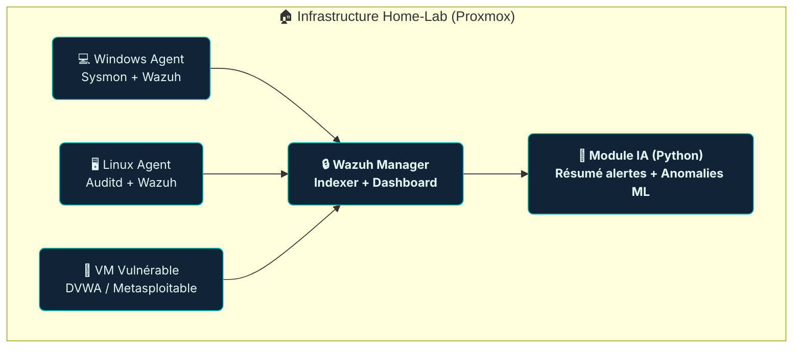

<p align="center">
  
  &nbsp;&nbsp;&nbsp;
  
</p>

# 🛡️ Mini-SOC personnel Wazuh augmenté par IA


---

## 📚 Table des matières
- [Introduction](#-introduction)
- [Architecture](#-architecture-globale)
- [Stack technique](#-stack-technique)
- [Prérequis et Environnement](#-prérequis-et-environnement)
- [Déploiement](#-déploiement)
- [Module IA (SOC augmenté)](#-module-ia-soc-augmenté)
- [Résultats et Visualisations](#-résultats-et-visualisations)
- [Roadmap & Améliorations](#-roadmap--améliorations)
- [Compétences acquises](#-compétences-acquises)
- [Références](#-références)
- [Auteur](#-auteur)

---

## 📘 Introduction
Ce projet vise à concevoir et déployer un **mini-SOC (Security Operations Center)** personnel complet, hébergé sur un **home-lab Proxmox**, combinant **détection, investigation et intelligence artificielle**.

🎯 **Objectifs principaux**
- Mettre en place un SOC fonctionnel basé sur **Wazuh** (SIEM open-source)
- Simuler des attaques réelles (brute-force, SQLi, reverse shell…)
- Collecter et corréler les logs via **Sysmon**, **Auditd**, et **OSQuery**
- Intégrer un module **IA/ML (Python + OpenAI)** pour automatiser :
  - Le **résumé des alertes**
  - La **priorisation** des incidents
  - La **détection comportementale** d’anomalies

💡 Ce projet illustre l’approche **DevSecOps + Blue Team + IA**, dans un cadre d’apprentissage pratique et reproductible.

---

## 🏗️ Architecture globale

### 🧭 Diagramme général



### 🔌 Flux réseau
| Composant | Port | Protocole | Rôle |
|------------|------|------------|------|
| Wazuh Manager | 1514/udp | Syslog | Réception des logs |
| Wazuh API | 55000/tcp | REST | Accès aux alertes |
| Dashboard | 5601/tcp | HTTPS | Interface d’analyse |
| Agents | 1514 / 55000 | TCP/UDP | Communication bidirectionnelle |

---

## ⚙️ Stack technique

| Domaine | Technologie | Rôle |
|----------|--------------|------|
| **SIEM** | Wazuh | Supervision, corrélation, alerting |
| **Logs** | Sysmon, Auditd, OSQuery | Collecte d’événements endpoints |
| **Infra** | Docker, Proxmox | Virtualisation & orchestration |
| **IA / ML** | Python, OpenAI API, scikit-learn, PyOD | Analyse & priorisation intelligente |
| **Dashboard** | Wazuh Dashboard / Grafana | Visualisation et reporting |
| **Tests d’attaque** | Metasploitable, DVWA | Génération d’événements de sécurité |
| **Automatisation** | n8n, Python scripts | Extraction et traitement des données |

---

## 🧩 Prérequis et Environnement

### 🧱 Home-Lab
- Hyperviseur : **Proxmox VE 8**
- OS principal : **Ubuntu Server 22.04 LTS**
- RAM : 16–32 Go  
- CPU : 6–8 vCPU  
- Stockage : SSD ≥ 256 Go  
- Réseau : Bridge local (vmbr0)

### 💻 Machines virtuelles
| VM | Système | Rôle |
|----|----------|------|
| `wazuh-manager` | Ubuntu | Wazuh Manager + Indexer + Dashboard |
| `win-endpoint` | Windows 10 | Endpoint + Sysmon + Agent |
| `linux-endpoint` | Ubuntu | Endpoint + Auditd + Agent |
| `dvwa-lab` | Ubuntu / LAMP | Application vulnérable (DVWA) |

---

## 🧰 Déploiement

### 1️⃣ Installation du Wazuh Stack
```bash
git clone https://github.com/wazuh/wazuh-docker.git
cd wazuh-docker
docker compose up -d
```
> Accès Dashboard : [https://IP-SERVEUR:5601](https://IP-SERVEUR:5601)

### 2️⃣ Déploiement des Agents
#### 🔹 Windows
- Installe **Sysmon** et **Wazuh Agent**
- Configure `ossec.conf` → IP du Manager
- Vérifie l’ajout via `manage_agents`

#### 🔹 Linux
- Installe `wazuh-agent` + `auditd`
- Active la collecte `/etc`, `/var/log`, `/home`

### 3️⃣ Vérification
```bash
docker ps
curl -u admin:password https://IP-SERVEUR:55000
```

### 4️⃣ Logs & Monitoring
- Logs : `/var/ossec/logs/alerts/alerts.json`
- Volume Docker : `wazuh_data:/var/lib/wazuh`
- Vérifie les indices : `wazuh-alerts-*`

---

## 🤖 Module IA (SOC augmenté)

### 🎯 Objectif
Intégrer une intelligence artificielle pour :
- **Résumer les alertes Wazuh** via GPT
- **Détecter les anomalies comportementales**
- **Proposer des recommandations automatiques**

### 🧠 Flux IA
*(Insère ici ton image : `assets/ai-pipeline.png`)*

    [Wazuh API] → [Python Collector] → [GPT / ML Model] → [Report / Dashboard]

### Exemple — Résumé IA (LLM)
```python
import requests, openai, json

alerts = requests.get("https://wazuh.local/api/alerts?severity>=3", verify=False).json()
prompt = f"Résume et priorise ces alertes : {json.dumps(alerts)}"

response = openai.ChatCompletion.create(
  model="gpt-4o-mini",
  messages=[{"role":"system","content":"Analyste SOC"},
            {"role":"user","content":prompt}]
)
print(response.choices[0].message.content)
```

### Exemple — Détection d’anomalies
```python
from sklearn.ensemble import IsolationForest
import pandas as pd

df = pd.read_csv("network_metrics.csv")
model = IsolationForest(contamination=0.02)
df["anomaly"] = model.fit_predict(df[["packets", "bytes_sent"]])
print(df[df["anomaly"] == -1])
```

---

## 📊 Résultats et Visualisations

### 🔍 Scénarios d’attaque simulés
| Scénario | Description | Détection |
|-----------|--------------|------------|
| Brute-force SSH | Tentative répétée de connexion SSH | Wazuh - Rule 5710 |
| SQL Injection | Exploitation DVWA | Wazuh - Web Attack |
| Reverse Shell | Connexion externe PowerShell | Sysmon + Wazuh |
| Privilege Escalation | Sudo / setuid abuse | Auditd + Wazuh |

### 📈 Tableau de bord
*(Ajoute une capture ici : `assets/wazuh-dashboard.png`)*

### 💬 Exemple de rapport d’incident
| Élément | Détail |
|----------|--------|
| **Incident** | Tentative brute-force SSH |
| **Horodatage** | 2025-10-20 14:23 |
| **MITRE ATT&CK** | T1110 - Brute Force |
| **Source IP** | 192.168.1.45 |
| **Actions IA** | Blocage IP + Audit logs |
| **Statut** | Résolu |

---

## 🧭 Roadmap & Améliorations
- [x] Déploiement Wazuh Stack (Docker)
- [x] Intégration Sysmon & Auditd
- [x] Scénarios d’attaque (DVWA, SSH)
- [x] Module IA (LLM + ML)
- [ ] Dashboard Streamlit “SOC Analyst”
- [ ] Ajout Suricata / Zeek
- [ ] Intégration TheHive / Cortex
- [ ] MISP pour Threat Intelligence
- [ ] LLM local (Ollama / Llama3)

---

## 💼 Compétences acquises

| Domaine | Compétences |
|----------|--------------|
| **Blue Team** | SOC, SIEM, corrélation, forensic |
| **DevSecOps** | Docker, IaC, CI/CD, monitoring |
| **IA / Data** | NLP, ML, automatisation Python |
| **Offensive** | Attaques DVWA, exploitation, MITRE |
| **Projet** | Architecture, documentation, reporting |

---

## 🔗 Références
- 📘 [Documentation Wazuh](https://documentation.wazuh.com)
- 🧠 [MITRE ATT&CK Framework](https://attack.mitre.org)
- 🐍 [Scikit-learn](https://scikit-learn.org/)
- 🧩 [OpenAI API](https://platform.openai.com/docs)

---

## 🌐 Contact & Communauté

<p align="center">
  <a href="mailto:contact.soc.ai.lab@gmail.com">
    
  </a>
  &nbsp;&nbsp;&nbsp;
  <a href="https://linkedin.com/in/yoto" target="_blank">
    
  </a>
  &nbsp;&nbsp;&nbsp;
  <a href="https://tryhackme.com/p/YouY0u" target="_blank">
    
  </a>
</p>
